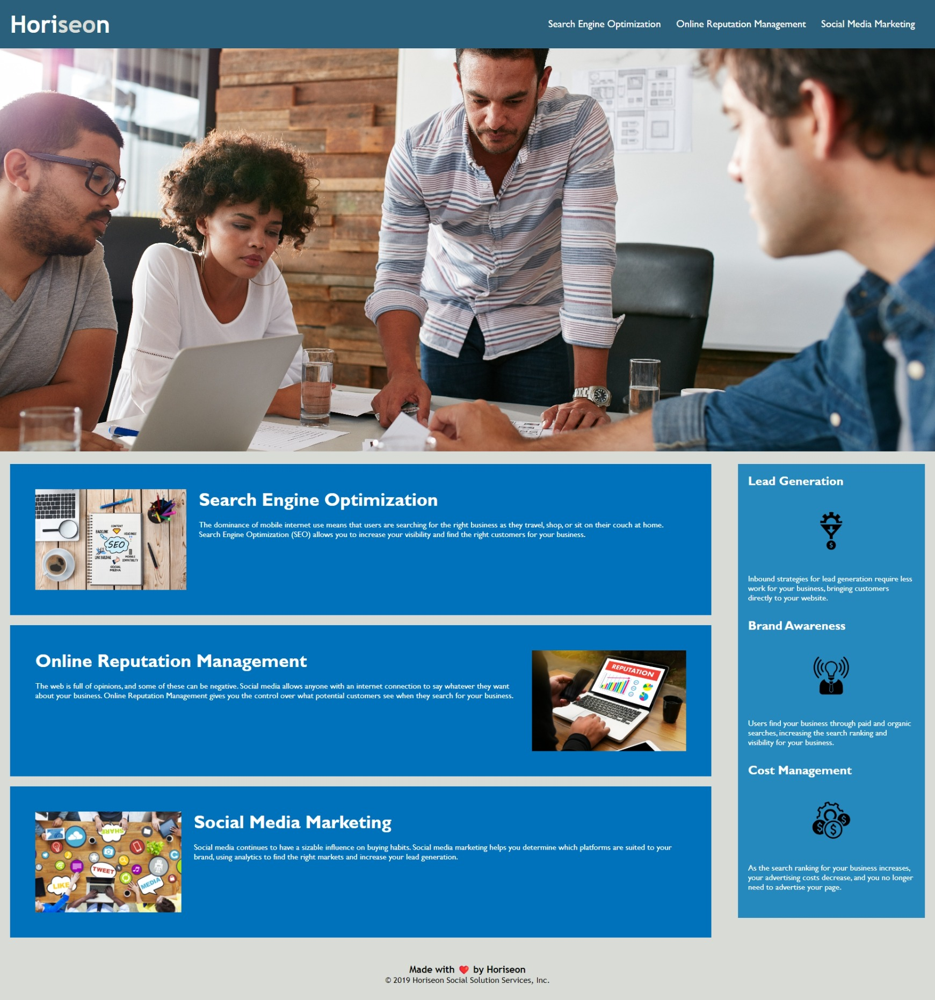

# Horiseon Social Solutions - Module Challenge 1

https://katychillingworth.github.io/Module-Challenge-1/

### User Story
AS A marketing agency
I WANT a codebase that follows accessibility standards
SO THAT our own site is optimized for search engines

### Acceptance Criteria
Your website must meet accessibility standards. You can achieve this completing the following:

Semantic HTML elements can be found throughout the source code
HTML elements follow a logical structure independent of styling and positioning
Image and icon elements contain accessible alt attributes
Heading attributes fall in sequential order
Title elements contain a concise, descriptive title

### Changes Made: 
- Added a more descriptive title
- Added semantic code e.g. header, footer, nav, section, aside
- Gave descriptive alt text to images and icons
- Added comments to make code easier to read/navigate
- Changed header tags to follow size heirarchy 
- Added ID attribute to SEO section to make link work

### Screenshot of Horiseon site

The following image shows the web application's appearance and functionality:

---
© 2022 edX Boot Camps LLC. Confidential and Proprietary. All Rights Reserved.
